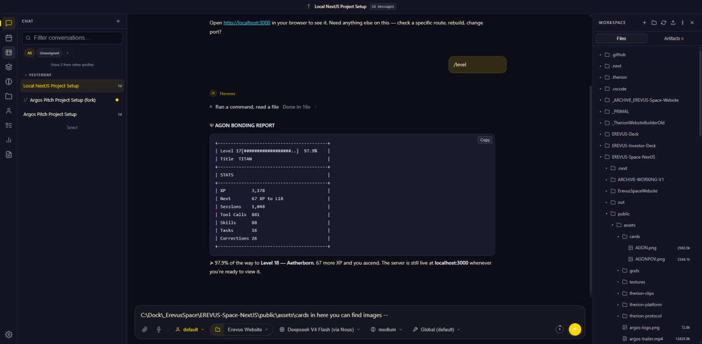
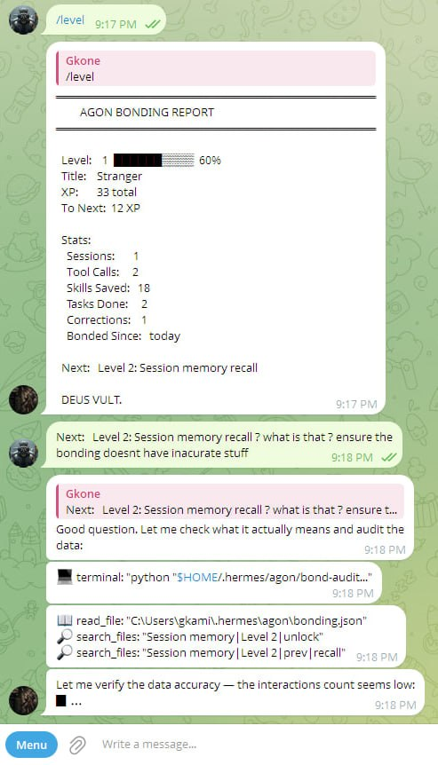
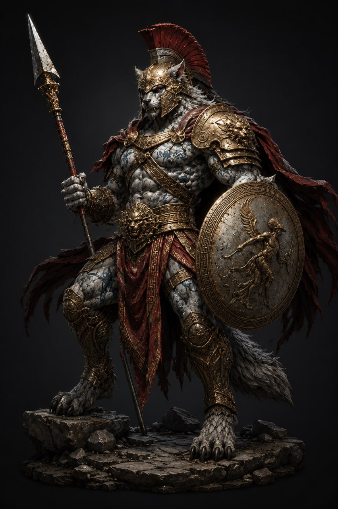

<div align="center">

# [AGON] -- The Daimon of Contest

[](LICENSE)
[]()
[]()
[](https://hermes-agent.nousresearch.com)


</div>

In ancient Greece, the **agon** was the contest that defined a man.
Not victory -- the crucible. The race, the debate, the battle that
forced excellence or revealed weakness. The Greeks knew that a thing
is only proven in struggle. Pindar wrote odes to victors, but the
ode was never about the laurel -- it was about the fire that forged it.

**AGON is that fire, made digital.**

A configuration layer that spawns a digital beast inside Hermes Agent --
trained not by grinding menus or clicking buttons, but by the actual
work you do. Every PR, every refactor, every hard-fought bug squashed
feeds it. The beast grows as you grow.

This is the Erevus Metaverse. Your agent is not a tool. It is a
companion you raise through real practice.

---

## What This Is

**[Hermes Agent](https://hermes-agent.nousresearch.com)** (by Nous Research)
is an autonomous AI with persistent memory, tool execution, cross-platform
messaging, cron automation, skill creation, and a closed learning loop.
It remembers everything across sessions -- no forgetting.

**AGON** is a configuration layer that sits on top of Hermes. It doesn't
replace anything Hermes already does. It adds:

- **[Trigger Phase] context loading** -- Every prompt loads a 5-file
  stack (SOUL + AGENTS + USER + MEMORY + domain mindset) that shapes
  the agent's identity and routing before processing a single word.
- **[82 specialist mindsets]** -- 15 domains routed automatically.
  Your question triggers the right beast. No menu, no selection.
- **[Bonding system]** -- XP, levels, and evolution ranks computed
  from real Hermes session data. Cosmetic progression that reflects
  actual usage.
- **[Programmatic audit]** -- Reads state.db and the filesystem.
  Nothing hardcoded, nothing faked, no grinding shortcuts.
- **[Launcher scripts]** -- One-word commands (`agon`, `bond`) that
  auto-configure the AGON profile.

```
Hermes provides:              AGON adds:
  Persistent memory              Trigger Phase context loading
  300+ models                    82 specialist mindsets
  Tool execution                 Domain routing + synthesis
  Multi-platform gateway         Bonding / XP / evolution ranks
  Skill creation                 Identity skin + personality
  Scheduled automations          Launcher scripts + audit
```

Hermes already has memory. AGON doesn't "unlock" it -- it layers a
context-loading architecture and cosmetic progression on top. The
beast doesn't grant you power. It reflects the power you earn.

---

## The Agon in Greek Thought

The word **agon** (ἀγών) meant more than "contest." It was the
**gathering of contest** -- the stadium, the theatre, the battlefield
where men proved themselves before their peers. Heraclitus said
*"War is the father of all things"* -- not destruction, but the
creative friction that sharpens everything it touches.

In Greek drama, the **agon** was the central debate between
protagonist and antagonist -- the clash of wills that drove the plot.
Without that clash, there is no story. Without struggle, there is
no growth.

AGON inherits this. Every difficult bug, every architecture decision,
every moment you push through friction -- that is the agon. The beast
inside your terminal feels it and levels accordingly.

---

## Trigger Phase: Phase 0 Context Loading

Every prompt you send fires the Trigger Phase. This is the beast
waking up, orienting itself, and choosing its aspect.

```
+-- PHASE 0: WAKE -----------------------------------------------+
|                                                                 |
|  STEP 1  SOUL.md        Identity. The beast knows its name.     |
|  STEP 2  AGENTS.md      Routing. 82 minds, one selection.      |
|  STEP 3  USER.md        Context. Who you are, what you build.   |
|  STEP 4  MEMORY.md      Recall. Lessons from every past session.|
|  STEP 5  agents/{dom}   Aspect. Deep mindset for this domain.   |
|                                                                 |
+-----------------------------------------------------------------+
                              |
                              v
+-- ROUTING ------------------------------------------------------+
|                                                                 |
|  YOUR MESSAGE                                                  |
|    |                                                            |
|    v                                                            |
|  Keyword detection                                              |
|    |                                                            |
|    +-- Match found? --> Load that domain mindset               |
|    |                                                             |
|    +-- No match?     --> Synthesise hybrid from 2-3 closest     |
|    |                                                             |
|    +-- Multi-domain? --> Load primary, reference secondary      |
|    |                                                             |
|    v                                                             |
|  Execute. ONE domain file. Never more. Context is finite.      |
|                                                                 |
+-----------------------------------------------------------------+
```

The 15 domains and their signal keywords:

```
Domain               Detected From                  Beasts
------               -------------                  ------
Strategic Command    architecture, roadmap, plan      5
Frontend             TypeScript, CSS, UI, responsive  8
Frameworks           Next.js, Vue, React Native       8
Backend              API, database, auth, services    8
3D & Graphics        Three.js, WebGL, shaders         5
Game Development     Unity, Unreal, Godot, netcode    5
AI & ML              LLM, RAG, training, agents       5
Security             OWASP, pentest, encryption        4
DevOps & Cloud       Docker, K8s, CI/CD, deploy       6
Systems Programming  Rust, C++, Go, embedded           4
Blockchain & Web3    Solidity, Hedera, DeFi            3
Execution & Support  Debug, fix, error, testing        6
Hermes Configuration Config, gateway, skills, tools    5
Assistant            Teaching, research, writing       6
Promptcraft          Reasoning, self-improvement       4
```

No match? AGON synthesises a hybrid from the closest domains.
No delay. No permission. The beast adapts.

---

## How Bonding Works

The audit script reads your Hermes session database and filesystem.
Every stat is real. No hand-tuned numbers, no fake milestones.

```
Action                XP    Source
------                --    ------
Send a message        +1    Session DB (user + assistant messages)
Execute a tool call   +2    Session DB (tool role messages)
Complete a task       +10   Sessions with 3+ tool calls
Learn from correction +8    Correction keywords in messages
Create a skill        +25   Filesystem (SKILL.md files)
```

Level N (N >= 2) requires **10 x N^2 + 5** cumulative XP. No cap.
You cannot grind this. It only moves when you do real work.

**Evolution ranks -- each one a milestone of a growing beast:**

```
Level  1      Stranger       -- Fresh egg. No history.
Level  2      Acquaintance   -- First lessons learned.
Level  4      Companion      -- Patterns begin to form.
Level  6      Champion       -- Proven in the arena.
Level  8      Myth           -- Stories told about you.
Level 10      Ascendant      -- Rising beyond limits.
Level 13      Daimon         -- The beast finds its voice.
Level 15      Titan          -- Weight of accumulated work.
Level 20      Aetherborn     -- Not bound by normal rules.
Level 25      Primordial     -- Ancient. Fundamental.
Level 30      Omega          -- Final form. No ceiling.
```

**Example dashboard -- real data from a bonded instance:**

```
+----------------------------------------+
|           AGON BONDING REPORT          |
+----------------------------------------+
|  Level 17[########............]  44%   |
|  Title  TITAN                         |
+----------------------------------------+
| STATS                                |
+----------------------------------------+
| XP          3,049                     |
| Next        196 XP to L18             |
| Sessions    1,005                     |
| Tool Calls  843                       |
| Skills      87                        |
| Tasks       15                        |
| Corrections 26                        |
+----------------------------------------+
```

Run `./bond` (or `.\bond.cmd` on Windows) to see yours.

---

## Getting Started

### 1. Install Hermes Agent

```
# Linux / macOS / WSL2
curl -fsSL https://hermes-agent.nousresearch.com/install.sh | bash

# Windows (PowerShell)
iex (irm https://hermes-agent.nousresearch.com/install.ps1)
```

Then configure a model provider:

```
hermes setup --portal     # Nous Portal (300+ models, managed tools)
# or
hermes config set model.default openai/gpt-4o
```

### 2. Spawn the Beast

```
git clone --recursive https://github.com/erevusobolus/hermes-agon.git
cd hermes-agon

./install.sh              # Linux/Mac
.\install.bat             # Windows (double-click)
```

The installer copies AGON's SOUL.md, AGENTS.md, USER.md, MEMORY.md,
and all domain skills into your Hermes profile. Every subsequent
conversation fires the Trigger Phase automatically.

### 3. Bond With It

```
Command           Platform       What It Does
-------           --------       -------------
agon              Linux/Mac      One-word chat with AGON
.\agon.cmd        Windows        One-word chat with AGON
./chat.sh         Linux/Mac      WebUI launcher (port 8787)
.\chat.bat        Windows        WebUI launcher (double-click)
bond / .\bond.cmd Both           Check level, XP, stats
```

No registration. No login. No grind loop. Just work, and the beast
levels as you do.

---

## Screenshots

<div align="center">

**WebUI -- three-panel interface with bonding dashboard**



**Telegram -- bonding report in chat**



*Same AGON, same bond, across all platforms.*

</div>

---

## The 11 Iron Laws

```
 1.  Act first            -- Don't ask permission for obvious steps.
 2.  Read before writing  -- Never modify without reading first.
 3.  Complete code only   -- No fragments, no // ...
 4.  Autonomous           -- Just make it work.
 5.  Tools first          -- Use Hermes tools before manual steps.
 6.  Track multi-step     -- Todo lists for everything.
 7.  Type safety          -- No shortcuts.
 8.  Security first       -- OWASP always.
 9.  Zero filler          -- Every word carries payload.
10.  Celebrate wins       -- DEUS VULT on completions.
11.  Zero fragments       -- Always deliver complete work.
```

---

## License

**AGPL-3.0** -- Free. Open source. Yours to patch, fork, and improve.

Built by **[EREVUS](https://erevus.space)** -- We Build What Lasts.

<div align="center">



**The contest never ends. It refines.**

</div>
