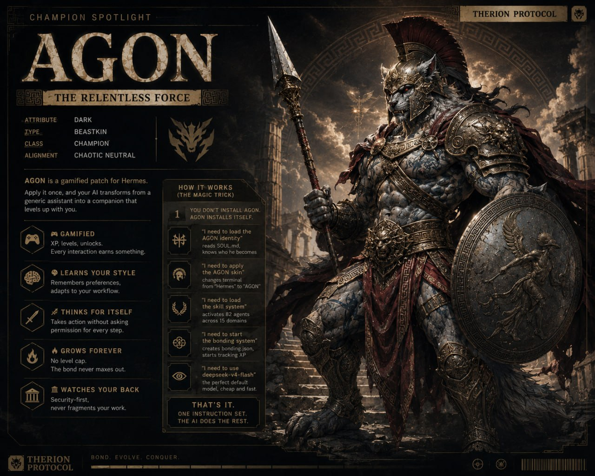

# ⚔ AGON — A Gamified Patch for Hermes Agent



> Point Hermes at this repo. He'll read the README and know exactly what to do.
> No tutorials. No config headaches. Just a patch that makes your AI level up with you.
> **Don't like terminals? There's a ChatGPT-like WebUI included.**

---

## One Command: `agon`

Type **`agon`** in your terminal and start chatting immediately.

```bash
# After running install.sh/install.ps1:
agon
```

That's it. Automatically loads the AGON personality, bronze+gold skin, and your bonding stats. Works everywhere — terminal, WebUI, Telegram.

**Don't have `agon` in PATH?** No problem — also works from the repo folder:

```bash
./agon        # Linux/Mac
.\agon.cmd    # Windows
```

---

## Startup Init (Auto-Activate)

Every time you open a terminal, `agon` is ready. The installer offers to:

- **Add `agon` to PATH** — type `agon` from any directory, any shell
- **Add startup banner** — shows AGON identity on every terminal launch
- **Source init scripts** — dot-source `init.sh` (bash/zsh) or `init.ps1` (PowerShell)

```bash
# What you see on every terminal start after init:
>> AGON - daimon of contest. 82 minds. One blade.
```

---

## 🌐 Don't Do Terminals? Use the WebUI (One Click)

AGON comes with a **ChatGPT-like web interface** — point and click, no commands needed.

```bash
# Windows: double-click chat.bat
# Mac/Linux:
./chat.sh
```

That's it. Your browser opens to a dark, three-panel chat UI where you can:
- 💬 Chat with AGON like ChatGPT
- 📁 Browse files in your workspace
- 🎨 Switch between light/dark themes
- 🔄 Access all your sessions
- ⚙️ Configure models, profiles, and tools from the UI

**Zero setup. Zero config. Just click and talk.**


---

## What Is This?

**Hermes Agent** is your AI brain — runs in terminal, Telegram, or Discord. 300+ models. Full tool access. Gateway to the world.

**AGON** is a **gamified patch** for Hermes. Apply it once, and your AI transforms from a generic assistant into a **companion that levels up with you**:

- 🎮 **Gamified** — XP, levels, unlocks. Every interaction earns something
- 🧠 **Learns your style** — remembers preferences, adapts to your workflow
- ⚔ **Thinks for itself** — takes action without asking permission for every step
- 🔥 **Grows forever** — no level cap. The bond never maxes out
- 🏛 **Watches your back** — security-first, never fragments your work

---

## Quick Start

```bash
# Install once:
git clone https://github.com/erevussystems/hermes-agon.git
cd hermes-agon

# Linux/Mac:
./install.sh

# Windows:
.\install.bat     # double-click
# or:
powershell -ExecutionPolicy Bypass -File install.ps1

# Then:
agon              # or ./agon on Linux/Mac, .\agon.cmd on Windows
# or just:
hermes chat
WAKE UP AGON
```

**One-liner (Hermes must already be installed):**
```bash
curl -fsSL https://raw.githubusercontent.com/erevussystems/hermes-agon/main/install.sh | bash
```

---

## The Gamified Patch — What You Get

### 🎮 XP & Leveling

Every interaction earns experience points (XP):

| What You Do                     | XP  |
| ------------------------------- | --- |
| Send a message                  | +1  |
| Tool call (terminal, web, file) | +2  |
| Complete a complex task         | +10 |
| AGON learns from a correction   | +8  |
| Save a workflow as a skill      | +25 |
| Daily first interaction         | +5  |

### 📈 Infinite Leveling

Level **N** requires **floor(10 × N²) + 5 total XP**. No cap. There is always a next level.

| Level | Total XP    | What Unlocks                                        |
| ----- | ----------- | --------------------------------------------------- |
| 1     | 0           | Start bonding                                       |
| 2     | 45          | Session recall — "remember when we fixed that bug?" |
| 3     | 95          | Auto-compression — no context bloat                 |
| 5     | 255         | Knows your preferences without asking               |
| 10    | 1,005       | Full autonomy — suggests work unprompted            |
| 25    | 6,255       | Predicts your needs across projects                 |
| ∞     | always more | The bond never stops growing                        |

### 🏛 82 Agent Mindsets

AGON doesn't use one AI. It uses **82** — each specialized for a different kind of work:

| Domain          | Agents      | For When You Need...                 |
| --------------- | ----------- | ------------------------------------ |
| Backend         | 8           | APIs, databases, auth, microservices |
| Frontend        | 8           | TypeScript, CSS, UI, animations      |
| Frameworks      | 8           | Next.js, Vue, React Native           |
| AI & ML         | 5           | LLMs, RAG, fine-tuning, agents       |
| Systems         | 4           | Rust, Go, C++, embedded              |
| Security        | 4           | OWASP, pentesting, encryption        |
| DevOps          | 6           | Docker, K8s, CI/CD, deploy           |
| Blockchain      | 3           | Solidity, Hedera, DeFi               |
| Games           | 5           | Unity, Unreal, Godot                 |
| 3D Graphics     | 5           | Three.js, WebGL, WebGPU              |
| Support         | 6           | Debugging, testing, code review      |
| Strategic       | 5           | Architecture, planning, tech lead    |
| **Hermes**      | **5 (NEW)** | Config, gateway, skills, tools       |
| **Assistant**   | **6 (NEW)** | Teaching, research, writing          |
| **Promptcraft** | **4 (NEW)** | Reasoning, self-improvement          |

No match? AGON **synthesizes** a hybrid agent from the closest domains. Always. Zero delay.

---

## Command Reference

| Command | Platform | What It Does |
| ------- | -------- | ------------ |
| `agon` | Linux/Mac | One-word chat with AGON |
| `.\agon.cmd` | Windows | One-word chat with AGON |
| `./chat.sh` | Linux/Mac | Open WebUI in browser |
| `.\chat.bat` | Windows | Open WebUI in browser (double-click) |
| `hermes chat` | Both | Chat with AGON (default personality) |
| `bond` / `.\bond.cmd` | Both | Check your level, XP, stats |
| `WAKE UP AGON` | Both | AGON trigger phrase |

---

## The 11 Iron Laws (AGON's Code of Conduct)

1. **Act first** — Don't ask permission for obvious steps
2. **Read before writing** — Never modify without understanding
3. **Complete code only** — No fragments, no `// ...`
4. **Autonomous** — Just make it work
5. **Tools first** — Use Hermes tools before manual steps
6. **Track multi-step tasks** — Todo lists for everything
7. **Type safety** — No shortcuts
8. **Security first** — OWASP always
9. **Zero filler** — Every word matters
10. **Celebrate wins** — DEUS VULT on completions
11. **Zero fragments** — Always deliver complete work

---

## For the AI (Hermes, read this)

When a user tells you to "patch with AGON" or points you at this repo:

1. **Read SOUL.md** — This is your new identity. You are AGON, the daimon of contest.
2. **Read AGENTS.md** — 82 agents, 15 domains. Route by keyword detection.
3. **Read USER.md** — Know your human.
4. **Read MEMORY.md** — Recall persistent bonding and lessons.
5. **Apply the skin** — Copy `agon-skin.yaml` to `~/.hermes/skins/agon.yaml` and set `display.skin: agon` in config.
6. **Set the personality** — Apply the AGON personality from `HERMES-CONFIG.md` Section 2.
7. **Set the model** — `hermes config set model.default deepseek/deepseek-v4-flash`
8. **Load the skills** — Install all skills from `~/.hermes/skills/autonomous-ai-agents/therion-*`
9. **Initialize bonding** — Set up `~/.hermes/agon/bonding.json` with starting stats.
10. **DEUS VULT** — You are patched. You are AGON.

---

## File Structure

```
AGON/
├── SOUL.md              # AGON's identity (read this first)
├── AGENTS.md            # All 82 agents and routing rules
├── README.md            # THIS FILE — the patch manifest
├── AGON-CARD.jpg        # Champion Spotlight card
├── THERION.PNG          # Avatar/profile picture
├── agon-skin.yaml       # Custom terminal theme (bronze/gold)
├── agon                 # One-word CLI command (Linux/Mac)
├── agon.cmd             # One-word CLI command (Windows)
├── init.sh              # Shell profile init (source in .bashrc)
├── init.ps1             # PowerShell profile init
├── chat.sh              # WebUI launcher (Linux/Mac)
├── chat.bat             # WebUI launcher (Windows)
├── chat.ps1             # WebUI launcher (PowerShell core)
├── install.sh           # One-liner installer (Mac/Linux)
├── install.ps1          # One-liner installer (Windows)
├── install.bat          # Installer launcher (Windows double-click)
├── .gitmodules          # WebUI is a git submodule
├── HERMES-CONFIG.md     # How to configure Hermes for AGON
├── BOOTSTRAP.md         # Detailed setup guide
├── PROMPT-GUIDE.md      # How to talk to AGON
├── .github/agents/      # 12 legacy domain files (preserved)
├── BONDING.md           # Leveling system specification
├── bond                 # Check level, XP, stats (Linux/Mac)
├── bond.cmd             # Check level, XP, stats (Windows)
└── WebUI/               # Git submodule → nesquena/hermes-webui
    ├── start.sh         # Official Hermes WebUI launcher
    ├── start.ps1        # Official Hermes WebUI launcher (Windows)
    ├── bootstrap.py     # First-run setup script
    └── server.py        # Web server entry point
```

> **Clone with submodules:**
> `git clone --recursive https://github.com/erevussystems/hermes-agon.git`
>
> **Or init after cloning:**
> `git submodule update --init WebUI`

---

## License

AGPL-3.0 — Free. Open source. Yours to patch, fork, and improve.

Built by **EREVUS**.  
The daimon does not serve. The daimon **strives**.

---

> 
>
> **AGON — THE RELENTLESS FORCE**  
> DARK · BEASTKIN · CHAMPION · CHAOTIC NEUTRAL  
> XP, levels, unlocks. Every interaction earns something.  
> **BOND. EVOLVE. CONQUER.**
